<p align="center">

</p>

---

[](https://docs.videosdk.live/react-native/guide/video-and-audio-calling-api-sdk/getting-started)
[](https://discord.gg/bGZtAbwvab)
[](https://app.videosdk.live/signup)

At Video SDK, we’re building tools to help companies create world-class collaborative products with capabilities of live audio/videos, compose cloud recordings/RTMP/HLS and interaction APIs.

## Demo App

📲 Download the sample iOS app here: https://testflight.apple.com/join/8hUKvpwT

📱 Download the sample Android app here: https://appdistribution.firebase.dev/i/9e63ac73eb4f49c3

## Interactive Livestream (HLS)

- Interactive live stream (HLS) is a media streaming protocol for delivering visual and audio media to viewers over the internet.
- Interactive live stream (HLS) allows you to distribute content and ensure excellent viewing experiences across devices, playback platforms, and network conditions. It is the ideal protocol for streaming video to large audiences scattered across geographies.

<p align="center">

</p>

- VideoSDK also allows you to configure the interactive livestream layouts in numerous ways like by simply setting different prebuilt layouts in the configuration or by providing your own [custom template](https://docs.videosdk.live/docs/tutorials/customized-layout) to do the livestream according to your layout choice.

## Setup Guide

- Sign up on [VideoSDK](https://app.videosdk.live/) and visit [API Keys](https://app.videosdk.live/api-keys) section to get your API key and Secret key.
- Get familiarized with [API key and Secret key](https://docs.videosdk.live/flutter/guide/video-and-audio-calling-api-sdk/signup-and-create-api).
- Get familiarized with [Token](https://docs.videosdk.live/flutter/guide/video-and-audio-calling-api-sdk/server-setup).

## Prerequisites

- React Native 0.59.10 or later
- Node 10 or later
- Valid Video SDK [Account](https://app.videosdk.live/)
- For Android
  - Java Development Kit (JDK) 8 or later
  - Android Studio (latest version recommended)
  - A physical or virtual mobile device running Android 5.0 or later
- For iOS
  - Xcode 9.4 or later
  - CocoaPods
  - A physical or virtual mobile device running iOS 9.0 or later

## Run the Sample Project

### Step 1: Clone the sample project

Clone the repository to your local environment.

```
git clone https://github.com/videosdk-live/videosdk-hls-react-native-sdk-example.git
```

### Step 2: Modify `src/api/api.js` file

Generate temporary token from [Video SDK Account](https://app.videosdk.live/signup).

```js
export const getToken = async () => {
  return 'VIDEOSDK_DASHBOARD_TOKEN'; // Update Token here
};
```

### Step 3: Install the dependencies

Install dependencies of all the project dependencies.

```
npm install
```

### Step 4: Run the sample app

Bingo, it's time to push the launch button.

```
npm run start
npm android
npm ios
```

## Key Concepts

- `Meeting` - A Meeting represents Real time audio and video communication.

  **`Note : Don't confuse with Room and Meeting keyword, both are same thing 😃`**

- `Sessions` - A particular duration you spend in a given meeting is a referred as session, you can have multiple session of a particular meetingId.
- `Participant` - Participant represents someone who is attending the meeting's session, `local partcipant` represents self (You), for this self, other participants are `remote participants`.
- `Stream` - Stream means video or audio media content that is either published by `local participant` or `remote participants`.
- `Mode` - There are 2 types of modes:

  `CONFERENCE`: Both audio and video streams will be produced and consumed in this mode.

  `VIEWER`: Audio and video streams will not be produced or consumed in this mode.

<br/>

## Android Permission

Add all the following permissions to AndroidManifest.xml file.

```
    <uses-feature android:name="android.hardware.camera" />
    <uses-feature android:name="android.hardware.camera.autofocus" />
    <uses-permission android:name="android.permission.RECORD_AUDIO" />
    <uses-permission android:name="android.permission.INTERNET" />
    <uses-permission android:name="android.permission.READ_PHONE_STATE" />
    <uses-permission android:name="android.permission.CAMERA" />
    <uses-permission android:name="android.permission.ACCESS_NETWORK_STATE" />
    <uses-permission android:name="android.permission.CHANGE_NETWORK_STATE" />

    <!-- Needed to communicate with already-paired Bluetooth devices. (Legacy up to Android 11) -->
    <uses-permission
        android:name="android.permission.BLUETOOTH"
        android:maxSdkVersion="30" />
    <uses-permission
        android:name="android.permission.BLUETOOTH_ADMIN"
        android:maxSdkVersion="30" />

    <!-- Needed to communicate with already-paired Bluetooth devices. (Android 12 upwards)-->
    <uses-permission android:name="android.permission.BLUETOOTH_CONNECT" />

```

## iOS Permission

Add the following entry to your Info.plist file, located at `<project root>/ios/Runner/Info.plist`:

```
<key>NSCameraUsageDescription</key>
<string>$(PRODUCT_NAME) Camera Usage!</string>
<key>NSMicrophoneUsageDescription</key>
<string>$(PRODUCT_NAME) Microphone Usage!</string>
```

## iOS screen share setup

Please refer to this documentation guide to [setup screenshare for iOS](https://docs.videosdk.live/react-native/guide/video-and-audio-calling-api-sdk/extras/react-native-ios-screen-share)

<br/>

## Token Generation

Token is used to create and validate a meeting using API and also initialise a meeting.

🛠️ `Development Environment`:

- For development, you can use temporary token. Visit VideoSDK [dashboard](https://app.videosdk.live/api-keys) to generate temporary token.

🌐 `Production Environment`:

- For production, you have to set up an authentication server to authorize users. Follow our official example repositories to setup authentication server, [videosdk-rtc-api-server-examples](https://github.com/videosdk-live/videosdk-rtc-api-server-examples)

<br/>

## API: Create and Validate meeting

- `create meeting` - Please refer this [documentation](https://docs.videosdk.live/api-reference/realtime-communication/create-room) to create meeting.
- `validate meeting`- Please refer this [documentation](https://docs.videosdk.live/api-reference/realtime-communication/validate-room) to validate the meetingId.

<br/>

## [Initialize a Meeting](https://docs.videosdk.live/react-native/api/sdk-reference/meeting-provider)

- You can initialize the meeting using `MeetingProvider`. Meeting Provider simplifies configuration of meeting with by wrapping up core logic with `react-context`.

```js
<MeetingProvider
  config={{
    meetingId: 'meeting-id',
    micEnabled: true,
    webcamEnabled: true,
    name: 'Participant Name',
    notification: {
      title: 'Code Sample',
      message: 'Meeting is running.',
    },
    participantId: 'xyz',
    // For Interactive Live Streaming we can provide mode, `CONFERENCE` for Speaker and  `VIEWER` for viewer audience.
    mode: 'CONFERENCE', // "CONFERENCE" || "VIEWER"
  }}
  token={'token'}></MeetingProvider>
```

<br/>

## [Mute/Unmute Local Audio](https://docs.videosdk.live/javascript/guide/video-and-audio-calling-api-sdk/features/mic-controls)

```js
const {unmuteMic, muteMic} = useMeeting();

const onPress = async () => {
  // Enable Mic in Meeting
  unmuteMic();

  // Disable Mic in Meeting
  muteMic();
};
```

<br/>

## [Change Audio Device](https://docs.videosdk.live/react-native/guide/video-and-audio-calling-api-sdk/features/switch-audio-output)

- The `getAudioDeviceList()` function allows a participant to list all of the attached audio devices (e.g., Bluetooth and Earphone).

```js
import {getAudioDeviceList} from '@videosdk.live/react-native-sdk';

const onPress = async () => {
  const device = await getAudioDeviceList();
  console.log('Device :', device); // ["SPEAKER_PHONE","WIRED_HEADSET"]
};
```

- Local participant can change the audio device using `switchAudioDevice()` method of `Room` class.

```js
import {switchAudioDevice} from '@videosdk.live/react-native-sdk';

switchAudioDevice('SPEAKER_PHONE'); // for device speaker

switchAudioDevice('EARPIECE'); // for device earpiece

switchAudioDevice('WIRED_HEADSET'); // for wired headset

switchAudioDevice('BLUETOOTH'); // for bluetooth device
```

- Please consult our documentation [Change Audio Device](https://docs.videosdk.live/react-native/guide/video-and-audio-calling-api-sdk/features/switch-audio-output) for more infromation.

<br/>

## [Enable/Disable Local Webcam](https://docs.videosdk.live/react-native/guide/video-and-audio-calling-api-sdk/features/camera-controls)

```js
const {enableWebcam, disableWebcam} = useMeeting();
const onPress = async () => {
  // Enable Webcam in Meeting
  enableWebcam();

  // Disable Webcam in Meeting
  disableWebcam();
};
```

<br/>

## [Switch Local Webcam](https://docs.videosdk.live/react-native/guide/video-and-audio-calling-api-sdk/features/camera-controls)

```js
const {changeWebcam, getWebcams} = useMeeting();
const onPress = async () => {
  // Change Webcam in Meeting
  const webcams = await getWebcams(); // returns all webcams

  const {deviceId, label} = webcams[0]; // 0th : Rear Cam, 1st : Front Cam

  changeWebcam(deviceId);
};
```

<br/>

## [Change Mode](https://docs.videosdk.live/react-native/api/sdk-reference/use-meeting/methods#changemode)

- If you want to change the mode of a participant, use the meeting's `changeMode()` method.

```js
const {changeMode} = useMeeting();

const toggleMode = () => {
  // For Viewer
  changeMode('VIEWER');

  // For Speaker
  changeMode('CONFERENCE');
};
```

<br/>

## [Start/Stop HLS](https://docs.videosdk.live/react-native/api/sdk-reference/use-meeting/methods#starthls)

```js
const {startHls, stopHls} = useMeeting({});

const config = {
  // Layout Configuration
  layout: {
    type: 'GRID', // "SPOTLIGHT" | "SIDEBAR",  Default : "GRID"
    priority: 'SPEAKER', // "PIN", Default : "SPEAKER"
    gridSize: 4, // MAX : 4
  },

  // Theme of recording
  theme: 'DARK', //  "LIGHT" | "DEFAULT"

  // `mode` is used to either record video & audio both or only audio.
  mode: 'video-and-audio', // "audio", Default : "video-and-audio"

  // Quality of recording and is only applicable to `video-and-audio` type mode.
  quality: 'high', // "low" | "med",  Default : "med"

  // This mode refers to orientation of recording.
  // landscape : Record the meeting in horizontally
  // portrait : Record the meeting in vertically (Best for mobile view)
  orientation: 'landscape', // "portrait",  Default : "landscape"
};

// start HLS
startHls(config);

// stop HLS
stopHls();
```

<br/>

## [Chat](https://docs.videosdk.live/react-native/guide/video-and-audio-calling-api-sdk/features/pubsub)

- The chat feature allows participants to send and receive messages about specific topics to which they have subscribed.

```js
// importing usePubSub hook from react-native-sdk
import {usePubSub} from '@videosdk.live/react-native-sdk';

// CHAT Topic
const {publish, messages} = usePubSub('CHAT');

// publish message
const sendMessage = () => {
  const message = 'Hello People!';
  publish(message, {persist: true});
};

// get latest messages
console.log('Messages : ', messages);
```

<br/>

## [Raise Hand](https://docs.videosdk.live/react-native/guide/video-and-audio-calling-api-sdk/features/pubsub)

- This feature allows participants to raise hand during the meeting.

```js
// importing usePubSub hook from react-native-sdk
import {usePubSub} from '@videosdk.live/react-native-sdk';

// RAISE_HAND Topic
const {publish} = usePubSub('RAISE_HAND');

// Publish Message
const RaiseHand = () => {
  publish('Raise Hand');
};
```

<br/>

## [Leave or End Meeting](https://docs.videosdk.live/react-native/guide/video-and-audio-calling-api-sdk/features/leave-end-meeting)

```js
const {leave, end} = useMeeting({});
const onPress = () => {
  // Only one participant will leave/exit the meeting; the rest of the participants will remain.
  leave();

  // The meeting will come to an end for each and every participant. So, use this function in accordance with your requirements.
  end();
};
```

<br/>

## [Meeting Event callbacks](https://docs.videosdk.live/react-native/api/sdk-reference/use-meeting/events)

By registering callback handlers, VideoSDK sends callbacks to the client app whenever there is a change or update in the meeting after a user joins.

```js
import { Constants, useMeeting } from "@videosdk.live/react-native-sdk";

function onParticipantJoined(participant) {
  // This event will be emitted when a new participant joined the meeting.
  // [participant]: new participant who joined the meeting
  console.log('onParticipantJoined', participant);
}
function onParticipantLeft(participant) {
  // This event will be emitted when a joined participant left the meeting.
  // [participantId]: id of participant who left the meeting
  console.log('onParticipantLeft', participant);
}
const onSpeakerChanged = activeSpeakerId => {
  // This event will be emitted when any participant starts or stops screen sharing.
  // [activeSpeakerId]: Id of participant who shares the screen.
  console.log('onSpeakerChanged', activeSpeakerId);
};
function onPresenterChanged(presenterId) {
  // This event will be emitted when a active speaker changed.
  // [presenterId] : Id of active speaker
  console.log('onPresenterChanged', presenterId);
}
function onMeetingJoined() {
  // This event will be emitted when a localParticipant(you) successfully joined the meeting.
  console.log('onMeetingJoined');
}
function onMeetingLeft() {
  // This event will be emitted when a localParticipant(you) left the meeting.
  console.log('onMeetingLeft');
}

function onHlsStateChanged(data) {
   const { status } = data;

  if (status === Constants.hlsEvents.HLS_STARTING) {
    console.log("Meeting Hls is starting");
  } else if (status === Constants.hlsEvents.HLS_STARTED) {
    console.log("Meeting Hls is started");
  } else if (status === Constants.hlsEvents.HLS_PLAYABLE) {
    // on hlsStateChanged started you will receive playbackHlsUrl
    const {playbackHlsUrl}=data;
    console.log("Meeting Hls is playable");
  } else if (status === Constants.hlsEvents.HLS_STOPPING) {
    console.log("Meeting Hls is stopping");
  } else if (status === Constants.hlsEvents.HLS_STOPPED) {
    console.log("Meeting Hls is stopped");
  } else {
    //
  }
 }

const {meetingId, meeting, localParticipant} = useMeeting({
  onParticipantJoined,
  onParticipantLeft,
  onSpeakerChanged,
  onPresenterChanged,
  onMeetingJoined,
  onMeetingLeft,
  onHlsStateChanged,
});
```

<br/>

## [Participant Events Callback](https://docs.videosdk.live/react-native/api/sdk-reference/use-participant/events)

By registering callback handlers, VideoSDK sends callbacks to the client app whenever a participant's video, audio, or screen share stream is enabled or disabled.

```js
  function onStreamEnabled(stream) {
    // This event will be triggered whenever a participant's video, audio or screen share stream is enabled.
    console.log(" onStreamEnabled", stream);
  }
  function onStreamDisabled(stream) {
    // This event will be triggered whenever a participant's video, audio or screen share stream is disabled.
    console.log(" onStreamDisabled", stream);
  }

  const {
    displayName
    ...
  } = useParticipant(participantId,{
    onStreamEnabled,
    onStreamDisabled,
  });
```

If you want to learn more about the SDK, read the Complete Documentation of [React Native VideoSDK](https://docs.videosdk.live/react-native/guide/video-and-audio-calling-api-sdk/getting-started)

<br/>

## Project Structure

We have separated screens and components in the following folder structure:

```
src
└── scenes
    └── home
    └── ILS
```

<br/>

### **1. Home Screen**

```
 home
   └── speaker
	└── index.js
   └── viewer
	└── index.js
    └── index.js
```

`home/index.js` : This file contains the home screen where `SPEAKER` or `VIEWER` will setup meeting.

<p align="left">
  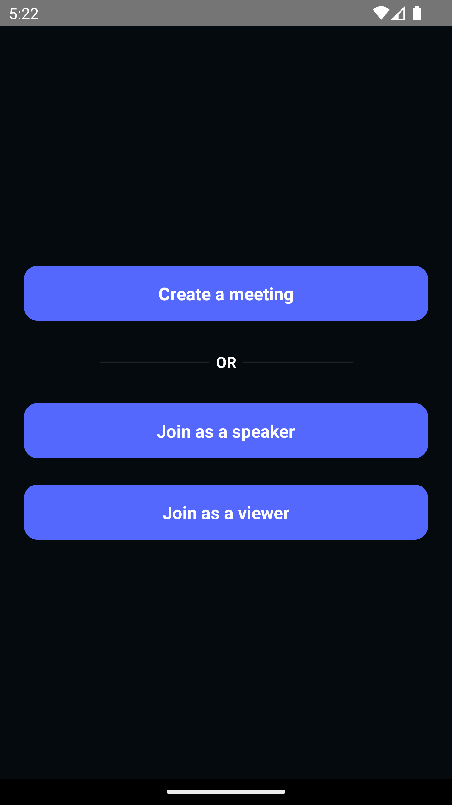
</p>

`home/speaker/index.js` : This file contains the join screen for `SPEAKER` creator or speaker.
<br/>

**Creator Join screen**

<p align="left">
  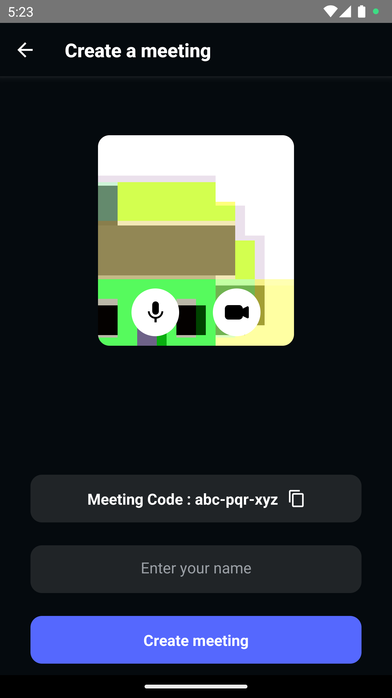
</p>
<br/>

**Speaker Join screen**

<p align="left">
  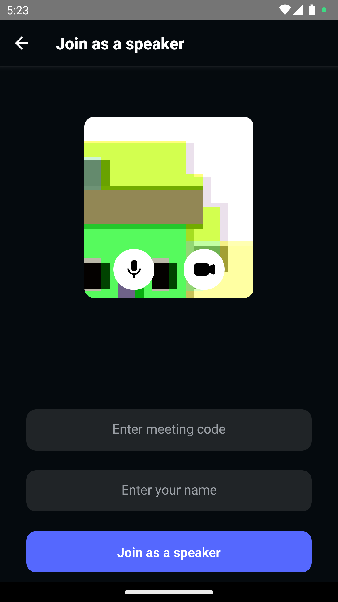
</p>

`home/viewer/index.js` : This file contains the join screen for the `VIEWER`, where the user has to enter `meetingId` and `username`

<p align="left">
  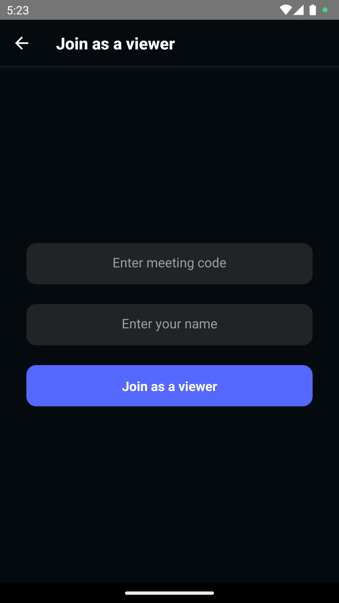
</p>

<br/>

### **2. ILS Screen**

```
 ILS
  └── Components
  └── Speaker
  └── Viewer
  └── index.js
  └── ILSContainer.js
```

- `ILS/index.js` : This file essentially initialise the meeting depending on the config given.
- `ILS/ILSContainer.js` : It directs users to the `VIEWER` or `SPEAKER` screen.

### Components

This folder contains all the common components used in `VIEWER` and `SPEAKER` screen.

```
Components
	└── ChatViewer
	└── ParticipantListViewer
	└── LocalParticipantPresenter.js
	└── WaitingToJoinView.js
```

#### ChatViewer

This component is solely responsible for managing chat in the meeting.

<p align="left">
  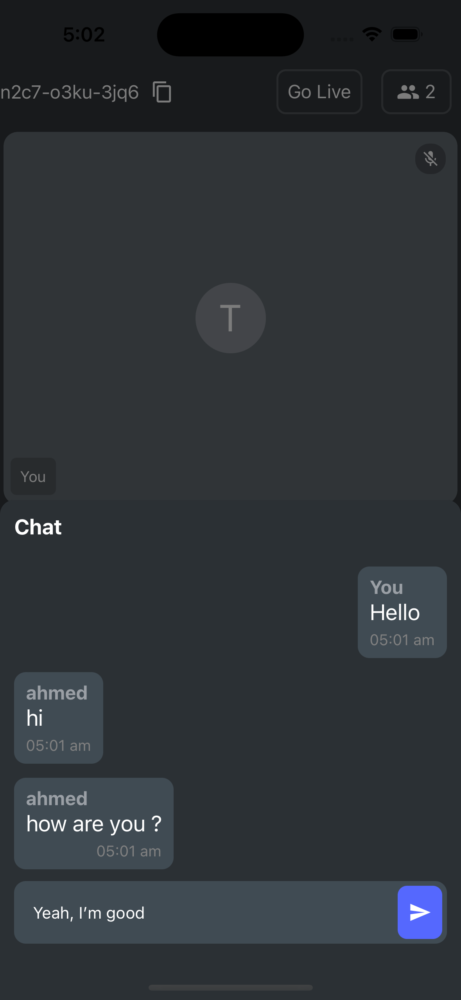
</p>

#### ParticipantListViewer

This component is solely responsible for managing the Participant list in the meeting.

<p align="left">
  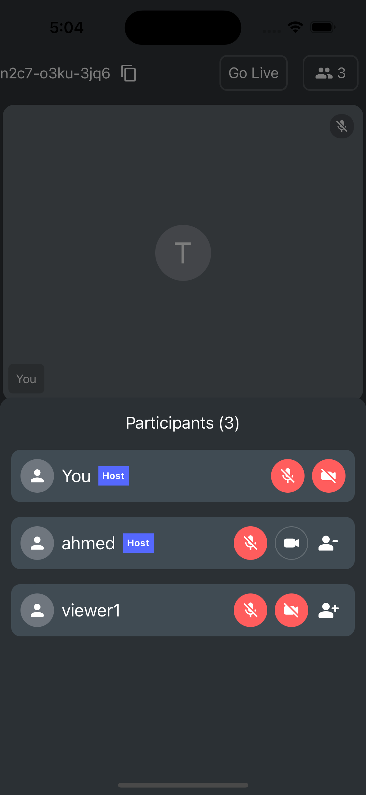
</p>

- **_Add as a co-Host_**

  - Here, we are using `pubSub` to request a viewer to be co-host. [Click here](https://docs.videosdk.live/react-native/guide/video-and-audio-calling-api-sdk/features/pubsub) to know more about `pubSub`.
   <p align="center">
     <b>Host   &emsp;&emsp;&emsp;&emsp;&emsp;&emsp;&emsp;&emsp;&emsp;&emsp;&emsp;&emsp;&emsp;&emsp;&emsp;&emsp;&emsp;&emsp;&emsp; Viewer </b>
  </p>
  <p align="center">
   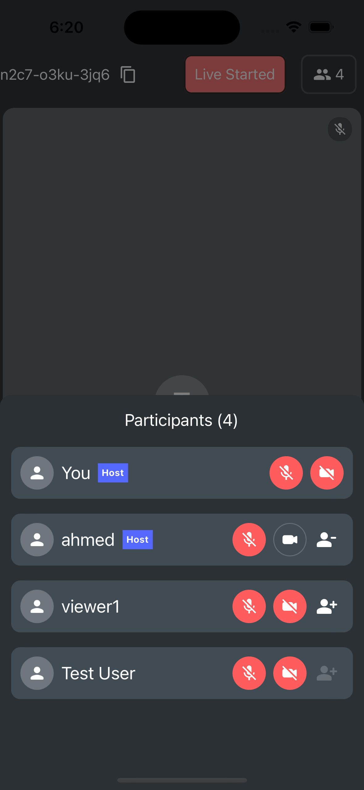
   &nbsp;&nbsp;&nbsp;&nbsp;&nbsp;&nbsp;&nbsp;&nbsp;
   
   </p>

<br/>

#### LocalParticipantPresenter.js

This component is used when local participant share the screen, you can check out the below image.

<p align="left">
  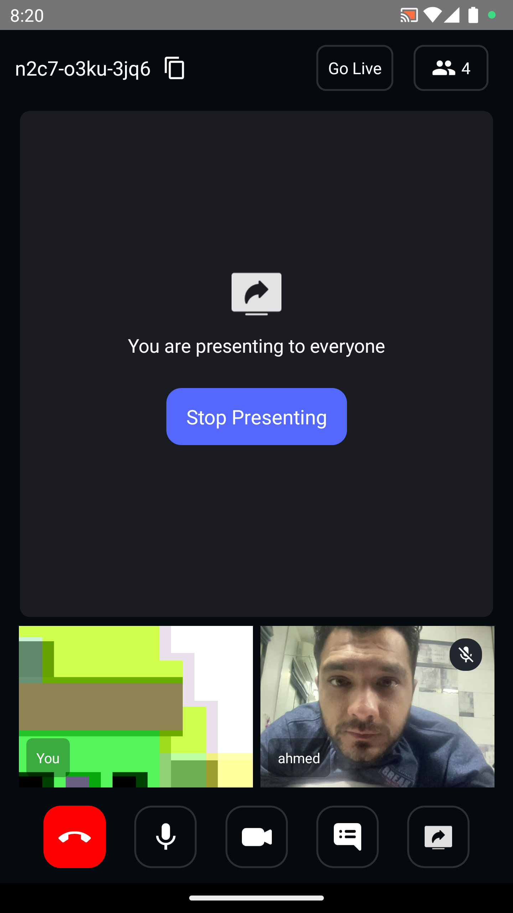
</p>

#### WaitingToJoinView.js

This component is act as a loader if a participant has not joined successfully.

<p align="left">
  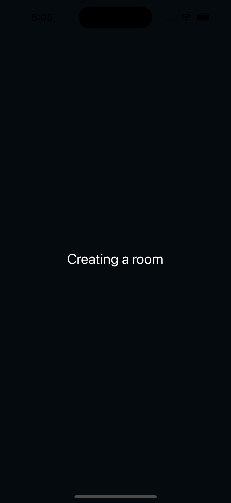
</p>

### Speaker

The whole user interface and business logic for the `SPEAKER` are contained in this folder.

```
Speaker
  └── MeetingViewer.js
  └── ParticipantGrid.js
  └── ParticipantView.js
  └── PauseInvisibleParticipant.js
  └── RemoteParticipantPresenter.js
```

#### MeetingViewer.js

This file essentially contains the layout for the entire speaker meeting.

<p align="left">
  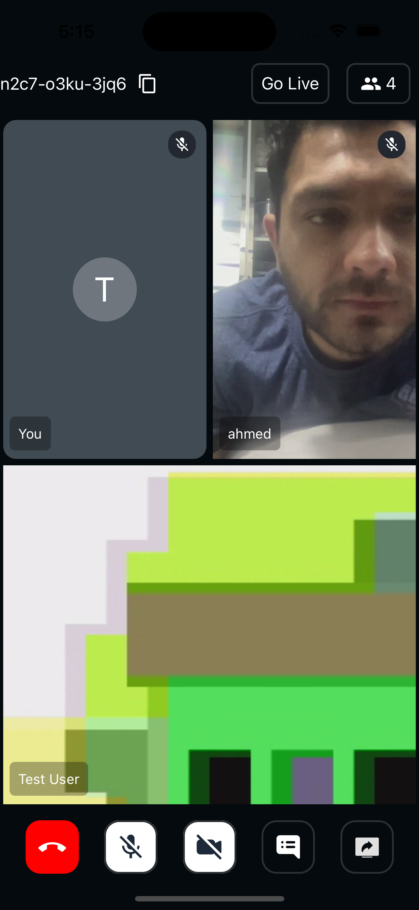
</p>

#### ParticipantGrid.js

This file is responsible for maintaining a grid with 6 participants in portrait and landscape modes.

#### ParticipantView.js

This file essentially maintains the stream of a particular participant as well as the status of controls (Mic and Cam)

#### PauseInvisibleParticipant.js

This file handles participants who are not in the participant grid.

#### RemoteParticipantPresenter.js

This file handles the screen share of the remote participant.

<p align="left">
  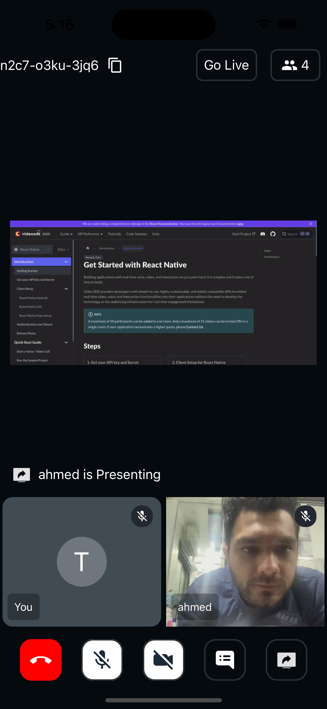
</p>

### Viewer

The whole user interface and business logic for the `VIEWER` are contained in this folder.

```
Viewer
  └── ViewerContainer.js
  └── ControlsOverlay.js
```

#### ViewerContainer.js

This file is responsible to show the `VIEWER` livestream and also allow them to interact with chat.

#### ControlsOverlay.js

This file is responsible for the player overlay which contains play/pause button, seek bar, etc.

</br>

**Portrait Viewer**

<p align="left">
  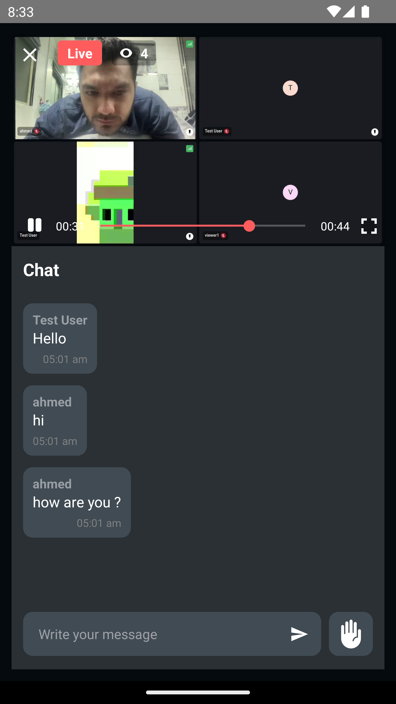
</p>

</br>

**Landscape Viewer**

<p align="left">
  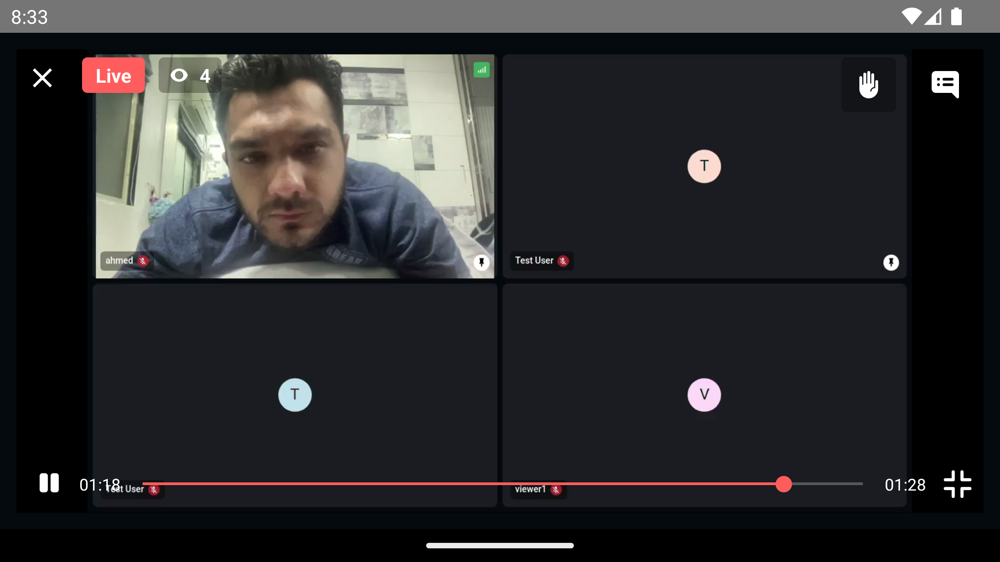
</p>
<br/>

## Examples
### Examples for Conference

- [videosdk-rtc-prebuilt-examples](https://github.com/videosdk-live/videosdk-rtc-prebuilt-examples)
- [videosdk-rtc-javascript-sdk-example](https://github.com/videosdk-live/videosdk-rtc-javascript-sdk-example)
- [videosdk-rtc-react-sdk-examplee](https://github.com/videosdk-live/videosdk-rtc-react-sdk-example)
- [videosdk-rtc-react-native-sdk-example](https://github.com/videosdk-live/videosdk-rtc-react-native-sdk-example)
- [videosdk-rtc-flutter-sdk-example](https://github.com/videosdk-live/videosdk-rtc-flutter-sdk-example)
- [videosdk-rtc-android-java-sdk-example](https://github.com/videosdk-live/videosdk-rtc-android-java-sdk-example)
- [videosdk-rtc-android-kotlin-sdk-example](https://github.com/videosdk-live/videosdk-rtc-android-kotlin-sdk-example)
- [videosdk-rtc-ios-sdk-example](https://github.com/videosdk-live/videosdk-rtc-ios-sdk-example)

### Examples for Live Streaming

- [videosdk-hls-react-sdk-example](https://github.com/videosdk-live/videosdk-hls-react-sdk-example)
- [videosdk-hls-react-native-sdk-example](https://github.com/videosdk-live/videosdk-hls-react-native-sdk-example)
- [videosdk-hls-flutter-sdk-example](https://github.com/videosdk-live/videosdk-hls-flutter-sdk-example)
- [videosdk-hls-android-java-example](https://github.com/videosdk-live/videosdk-hls-android-java-example)
- [videosdk-hls-android-kotlin-example](https://github.com/videosdk-live/videosdk-hls-android-kotlin-example)

<br/>

## Documentation

[Read the documentation](https://docs.videosdk.live/) to start using Video SDK.

<br/>

## Community

- [Discord](https://discord.gg/Gpmj6eCq5u) - To get involved with the Video SDK community, ask questions and share tips.
- [Twitter](https://twitter.com/video_sdk) - To receive updates, announcements, blog posts, and general Video SDK tips.
